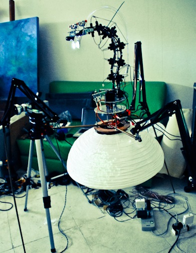

# H.A. – hiperorganismo_antropofagico

Códigos Arduino e Processing para o sistema robótico H.A. desenvolvido em ambiente de pesquisa do NANO. 
Mais informações sobre o projeto no <a href="http://www.nano.eba.ufrj.br/nano_projetos/laboratorium-mapa-d2/">site do NANO</a>.

<h3>Sobre o Projeto</h3>
O Hiperorganismo Antropofágico consiste de uma placa arduino com uma câmera, sensores de presença, motores e outros componentes. Ao identificar um rosto, ele acompanha o movimento da pessoa movendo-se. A estrutura completa pode ser observada através de vídeos e imagens no site do NANO.

